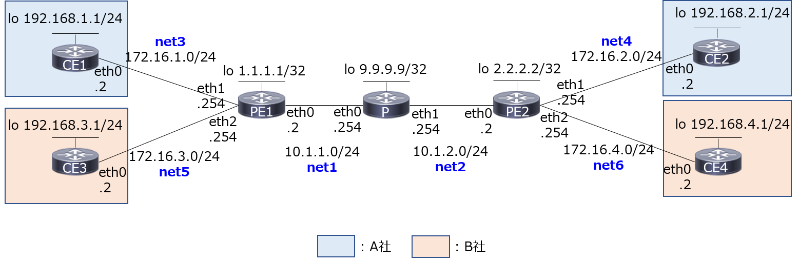

# What's this?
[Docker上のFRRoutingでMPLS-VPNを動かしてみる](https://qiita.com/tk_n/items/06c388164491ad634c7e)をdocker-compose化したものです。

MPLS-VPN using FRRouting on Docker (docker-compose version)




# 前提条件

```
# docker network ls
NETWORK ID          NAME                DRIVER              SCOPE
f7691e525fcd        bridge              bridge              local
5df12997a7cf        host                host                local
315847e7b1fe        none                null                local
```

# 使い方

```
# docker-compose build

# docker-compose up -d
Creating network "net1" with driver "bridge"
Creating network "net2" with driver "bridge"
Creating network "net3" with driver "bridge"
Creating network "net5" with driver "bridge"
Creating network "net4" with driver "bridge"
Creating network "net6" with driver "bridge"
Creating PE2 ... done
Creating CE2 ... done
Creating CE1 ... done
Creating CE3 ... done
Creating PE1 ... done
Creating PR  ... done
Creating CE4 ... done

# docker ps
CONTAINER ID        IMAGE               COMMAND                  CREATED             STATUS              PORTS               NAMES
5b396f4da533        frr_ce4             "/sbin/tini -- /usr/…"   28 seconds ago      Up 22 seconds                           CE4
6edb14cc92bd        frr_pr              "/sbin/tini -- /usr/…"   28 seconds ago      Up 25 seconds                           PR
d9c87dbfa3e2        frr_ce3             "/sbin/tini -- /usr/…"   28 seconds ago      Up 23 seconds                           CE3
a2902746657d        frr_pe1             "/sbin/tini -- /usr/…"   28 seconds ago      Up 23 seconds                           PE1
f3245984c514        frr_ce1             "/sbin/tini -- /usr/…"   28 seconds ago      Up 25 seconds                           CE1
6e6801852699        frr_ce2             "/sbin/tini -- /usr/…"   28 seconds ago      Up 24 seconds                           CE2
393d648e9c6c        frr_pe2             "/sbin/tini -- /usr/…"   28 seconds ago      Up 21 seconds                           PE2

```

経路交換、ラベル交換が終わるまで1分ほど待機

Wait for route and label exchange (about 1 min)

```
# docker exec -it CE1 /bin/sh
/ # ping -I 192.168.1.1 192.168.2.1
PING 192.168.2.1 (192.168.2.1) from 192.168.1.1: 56 data bytes
64 bytes from 192.168.2.1: seq=0 ttl=62 time=0.478 ms
64 bytes from 192.168.2.1: seq=1 ttl=62 time=0.322 ms
64 bytes from 192.168.2.1: seq=2 ttl=62 time=0.230 ms
^C
--- 192.168.2.1 ping statistics ---
3 packets transmitted, 3 packets received, 0% packet loss
round-trip min/avg/max = 0.230/0.343/0.478 ms
```


